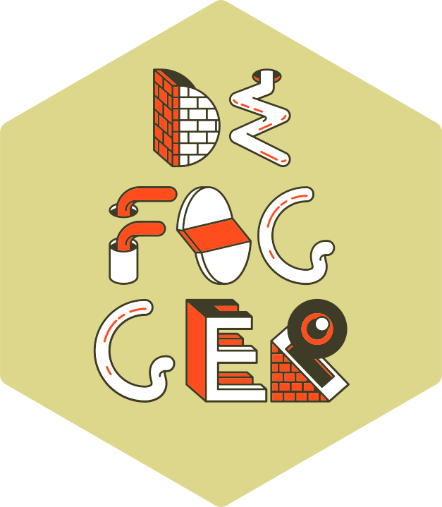

<!-- README.md is generated from README.Rmd. Please edit that file -->

```{r, include = FALSE}
knitr::opts_chunk$set(
  collapse = TRUE,
  comment = "#>",
  fig.path = "man/figures/README-",
  out.width = "100%"
)
```

# `defogger` <a href="https://andrewallenbruce.github.io/defogger/"></a>

> Streamlined Workflow for Transparency in Coverage (TiC) Data Analysis

<!-- badges: start -->

[](https://github.com/andrewallenbruce/defogger/actions/workflows/R-CMD-check.yaml)
[](https://lifecycle.r-lib.org/articles/stages.html#experimental)
[](https://www.repostatus.org/#wip)
[](https://choosealicense.com/licenses/mit/)
[](https://github.com/andrewallenbruce/defogger)
[](https://github.com/andrewallenbruce/defogger/commits/main)
[](https://app.codecov.io/gh/andrewallenbruce/defogger?branch=main)
<!-- badges: end -->

<br><br>

## Installation

You can install the development version of `defogger` from
[GitHub](https://github.com/) with:

``` r
# install.packages("devtools")
devtools::install_github("andrewallenbruce/defogger")

# install.packages("remotes")
remotes::install_github("andrewallenbruce/defogger")
```

```{r}
# Load library
library(defogger)
```


<br>


## Defogging Transparency in Coverage Files

<br>

The [Transparency in Coverage Final
Rule](https://www.cms.gov/newsroom/fact-sheets/transparency-coverage-final-rule-fact-sheet-cms-9915-f)[^2]
requires most group health plans and issuers of group or individual
health insurance to disclose pricing information in the form of
machine-readable files containing the following sets of costs for items
and services:

<br>

-   **In-Network Rate File:** Rates for all covered items and services
    between the plan or issuer and in-network providers.

<br>

-   **Allowed Amount File:** Allowed amounts for, and billed charges
    from, out-of-network providers.

<br>

## Usage

```{r}
res <- httr2::request("https://transparency-in-coverage.uhc.com/api/v1/uhc/blobs/") |> 
       httr2::req_perform() |> 
       httr2::resp_body_json(check_type = FALSE, 
                             simplifyVector = TRUE)

res$blobs |> 
  tibble::tibble() |> 
  dplyr::slice_tail() |> 
  dplyr::glimpse()
```
<br><br>

```{r}
dl <- res$blobs |> tibble::tibble() |> dplyr::slice_tail()

dll <- httr2::request(dl$downloadUrl) |> 
       httr2::req_perform() |> 
       httr2::resp_body_json(check_type = FALSE, simplifyVector = TRUE)

dll$reporting_structure |> 
  tidyr::unnest(cols = c(reporting_plans, in_network_files)) |> 
  dplyr::glimpse()
```
<br><br>

```{r}
dll$reporting_structure |> 
  tidyr::unnest(cols = c(reporting_plans, in_network_files)) |> 
  purrr::pluck("location", 1)
```
<br>

```{r}
dll$reporting_structure |> 
  tidyr::unnest(cols = c(reporting_plans, in_network_files)) |> 
  purrr::pluck("location", 2)
```
<br><br>

```{r}
centene_toc_jun <- "https://www.centene.com/content/dam/centene/Centene%20Corporate/json/DOCUMENT/2022-06-29_ambetter_index.json"
centene_toc_sep <- "https://www.centene.com/content/dam/centene/Centene%20Corporate/json/DOCUMENT/2022-09-30_ambetter_index.json"
centene_toc_dec <- "https://www.centene.com/content/dam/centene/Centene%20Corporate/json/DOCUMENT/2022-12-29_ambetter_index.json"
```

<br>

```{r}
defog_toc(centene_toc_dec) |> 
  dplyr::select(!c(id, 
                   plan_id_type, 
                   plan_market_type, 
                   entity)) |> 
  dplyr::slice_head() |> 
  dplyr::glimpse()
```

<br>

# Out-of-Network Files

```{r}
defog_toc(centene_toc_dec) |> 
  dplyr::filter(rate_type == "out_of_network") |> 
  dplyr::select(location) |> 
  dplyr::distinct() |> 
  tibble::deframe()
```

<br>

```{r}
centene_oon <- defog_toc(centene_toc_dec) |> 
  dplyr::filter(rate_type == "out_of_network") |> 
  dplyr::select(location) |> 
  dplyr::distinct()

defog_oon(tibble::deframe(centene_oon[10, ])) |> 
  dplyr::select(npi, billing_code, name, allowed_amount, billed_charge) |> 
  knitr::kable()
```

<br><br>

# In-Network Files

<br>

```{r}
defog_toc(centene_toc_dec) |> 
  dplyr::filter(rate_type == "in_network") |> 
  dplyr::select(location) |> 
  dplyr::distinct() |> 
  tibble::deframe()
```

<br>

```{r}
centene_inn <- defog_toc(centene_toc_dec) |> 
  dplyr::filter(rate_type == "in_network") |> 
  dplyr::select(location) |> 
  dplyr::distinct()

defog_inn(tibble::deframe(centene_inn[10, ])) |> 
  dplyr::slice_head(n = 30) |> 
  dplyr::select(npi,
                billing_code,
                billing_code_modifier,
                name, 
                negotiated_rate) |> 
  knitr::kable()
```


<br>

## Code of Conduct

Please note that the `defogger` project is released with a [Contributor
Code of
Conduct](https://andrewallenbruce.github.io/defogger/CODE_OF_CONDUCT.html).
By contributing to this project, you agree to abide by its terms.
