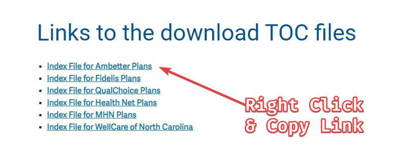

```{r setup, include = FALSE}
knitr::opts_chunk$set(
  collapse = TRUE,
  echo      = TRUE, 
  message   = FALSE, 
  warning   = FALSE,
  tidy = "styler",
  comment = "#>",
  dpi = 72, 
  out.width = "100%",
  dev = "png",
  dev.args = list(png = list(type = "cairo-png")),
  optipng = "-o1 -quiet",
  error = TRUE
)

library(defogger)
```


```{r}
library(tidyverse)
library(kableExtra)
library(defogger)
```

The path to analyzing a health insurance company's Transparency in Coverage (TiC) files begins at their public TiC site. Centene Corporation's is located [here](https://www.centene.com/price-transparency-files.html). To begin, you simply have to right-click and copy one of the links' URL addresses:
<br>

[](https://www.centene.com/price-transparency-files.html)

<br>
Then assign it to an object in R:

```{r}
centene_url <- "https://www.centene.com/content/dam/centene/Centene%20Corporate/json/DOCUMENT/2022-06-29_ambetter_index.json"
```

<br>

>It's important to note that this is a **Table of Contents (TOC) file**. TOC files are what you'll start with as they contain top-level information such as each plan's name, id, market (individual or group), and the URL address of each plan's in-network negotiated rates and out-of-network allowable amounts.

<br>

You can retrieve and parse a TOC file with the `defog_toc()` function:

```{r}
centene_toc <- defog_toc(centene_url) |> dplyr::slice_head(n = 10)
```

<br>

This returns a data frame containing 2,598 rows, so, for simplicity's sake, I've limited it to the first 10 rows:

<br>

```{r echo=FALSE}
centene_toc |> 
  dplyr::select(!c(id, 
                   plan_id_type, 
                   plan_market_type,
                   entity)) |> 
  knitr::kable(
    col.names = c(
    "Plan Name", 
    "Plan ID", 
    "Rate Type", 
    "Location"), 
    align = c('l')) |> 
  kableExtra::scroll_box(width = "100%",
                         fixed_thead = TRUE)
```

<br>
<br>

# Out-of-Network Files

<br>

Next we'll download one of the *out-of-network (OON)* files, also known as "allowed amounts" files. From the results above, we can filter the `rate_type` column to `out_of_network` and make sure to remove duplicate URLs with {dplyr}'s `distinct()` function:

<br>

```{r}
centene_oon_CA <- centene_toc |> 
  dplyr::filter(rate_type == "out_of_network") |> 
  dplyr::select(location) |> 
  dplyr::distinct() |> 
  tibble::deframe()
```


```{r echo=FALSE}
centene_oon_CA
```

<br>

Next, plug the URL object into the `defog_oon()` function and retrieve the file:

```{r}
centene_oon_CA_file <- defog_oon(centene_oon_CA) |> 
  dplyr::slice_head(n = 10)
```

```{r echo=FALSE}
centene_oon_CA_file |> 
  dplyr::select(npi,
                billing_code,
                name, 
                allowed_amount,
                billed_charge) |> 
  knitr::kable(
    col.names = c(
    "NPI", 
    "Billing Code", 
    "Description", 
    "Allowed Amount", 
    "Billed Charge"), 
    align = c('l')) |> 
  kableExtra::scroll_box(width = "100%", 
                         height = "100%", 
                         fixed_thead = TRUE)
```

<br>

Again, I've limited the output to the first ten rows for demonstration purposes, but this gives you a good idea of what an OON file contains. Next, we'll retrieve an in-network file.

<br>
<br>

# In-Network Files

<br>

The workflow for an *in-network (INN)* file is much the same, though the output is different, thus the need for a different function. This time, we filter the `rate_type` column to `in_network`, again making sure to remove duplicate URLs:

<br>

```{r}
centene_inn_CA <- centene_toc |> 
  dplyr::filter(rate_type == "in_network") |> 
  dplyr::select(location) |> 
  dplyr::distinct() |> 
  tibble::deframe()
```


```{r echo=FALSE}
centene_inn_CA
```

<br>

And plug the URL object into the `defog_inn()` function:

<br>

```{r}
centene_inn_CA_file <- defog_inn(centene_inn_CA) |> 
  dplyr::slice_head(n = 10)
```

```{r echo=FALSE}
centene_inn_CA_file |> 
  dplyr::select(npi,
                billing_code,
                billing_code_modifier,
                name, 
                negotiated_rate) |> 
  knitr::kable(
    col.names = c(
    "NPI", 
    "Billing Code", 
    "Modifier",
    "Description", 
    "Negotiated Rate"), 
    align = c('l')) |> 
  kableExtra::scroll_box(width = "100%", 
                         height = "100%", 
                         fixed_thead = TRUE)
```

<br>

The output shows the first ten rows out of 141,580 total.

This is, without a doubt, an embarassment of riches for those of us in healthcare data analytics. However, there are some absent data points that would enable us to expand our analysis even further. This is where the NPPES NPI Registry API comes in handy.

<br>
<br>

# Provider Data & the NPPES

Using the [NPPES Registry Search](https://npiregistry.cms.hhs.gov/search), we can retrieve data such as a provider's taxonomy, credentials, gender, NPI type, payer-specific identifiers, etc. First, we need to isolate the distinct NPIs from both the OON and INN results above. We have five distinct NPIs from the out-of-network file:

<br>

```{r}
# OON file
centene_oon_npi <- centene_oon_CA_file |> 
  dplyr::distinct(npi) |> 
  unlist(use.names = FALSE)
```


```{r echo=FALSE}
centene_oon_npi
```
<br>

And 10 distinct NPIs from the in-network file:

<br>

```{r}
# INN file
centene_inn_npi <- centene_inn_CA_file |> 
  dplyr::distinct(npi) |> 
  unlist(use.names = FALSE)
```


```{r echo=FALSE}
centene_inn_npi
```

<br>

Next, we pipe them both into {defogger}'s NPPES search function, `defog_npi()`, via {purrr}'s `map_dfr()`:

<br>

```{r}
# OON file NPIs
centene_oon_npi_resp <- centene_oon_npi |> 
  purrr::map_dfr(defog_npi)
```


```{r echo=FALSE}
centene_oon_npi_resp
```

```{r}
# INN file NPIs
centene_inn_npi_resp <- centene_inn_npi |> 
  purrr::map_dfr(defog_npi)
```


```{r echo=FALSE}
centene_inn_npi_resp
```

<br>

This gives us two responses from the NPPES API, which we can unpack with the `defog_npi_wide()` function:

<br>

```{r}
# OON file response
centene_oon_npi_result <- centene_oon_npi_resp |> 
  dplyr::group_split(search) |> 
  purrr::map_dfr(defog_npi_wide)
```


```{r echo=FALSE}
centene_oon_npi_result |> 
    dplyr::select(npi,
                  prov_type,
                  organization_name,
                  last_name,
                  first_name,
                  credential, 
                  address_1,
                  city,
                  state_abb,
                  taxon_code,
                  taxon_desc,
                  identifier,
                  ident_desc,
                  ident_issuer) |> 
  knitr::kable(
    col.names = c(
    "NPI", 
    "Type", 
    "Org Name",
    "Last", 
    "First",
    "Credential",
    "Address",
    "City",
    "State",
    "Taxonomy",
    "Specialty",
    "ID",
    "ID Desc",
    "ID Issuer"), 
    align = c('l')) |> 
  kableExtra::scroll_box(width = "100%", 
                         height = "500px", 
                         fixed_thead = TRUE)
```

<br>

```{r}
# INN file response
centene_inn_npi_result <- centene_inn_npi_resp |> 
  dplyr::group_split(search) |> 
  purrr::map_dfr(defog_npi_wide)
```

```{r echo=FALSE}
centene_inn_npi_result |> 
  dplyr::select(npi,
                prov_type,
                #organization_name,
                last_name,
                first_name,
                credential, 
                address_1,
                city,
                state_abb,
                taxon_code,
                taxon_desc,
                identifier,
                ident_desc,
                ident_issuer) |> 
  knitr::kable(
    col.names = c(
    "NPI", 
    "Type", 
    #"Org Name",
    "Last", 
    "First",
    "Credential",
    "Address",
    "City",
    "State",
    "Taxonomy",
    "Specialty",
    "ID",
    "ID Desc",
    "ID Issuer"), 
    align = c('l')) |> 
  kableExtra::scroll_box(width = "100%", 
                         height = "500px", 
                         fixed_thead = TRUE)
```

<br>

We can then join the two pairs of data frames for further analysis:

<br>

```{r}
# OON join
centene_oon_npi_join <- dplyr::full_join(
  centene_oon_CA_file, 
  centene_oon_npi_result, 
  by = "npi")
```


```{r echo=FALSE}
centene_oon_npi_join
```

<br>

```{r}
# INN join
centene_inn_npi_join <- dplyr::full_join(
  centene_inn_CA_file, 
  centene_inn_npi_result, 
  by = "npi")
```


```{r echo=FALSE}
centene_inn_npi_join
```


<br>

